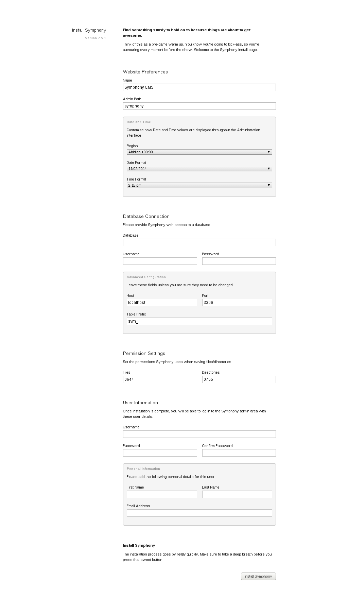
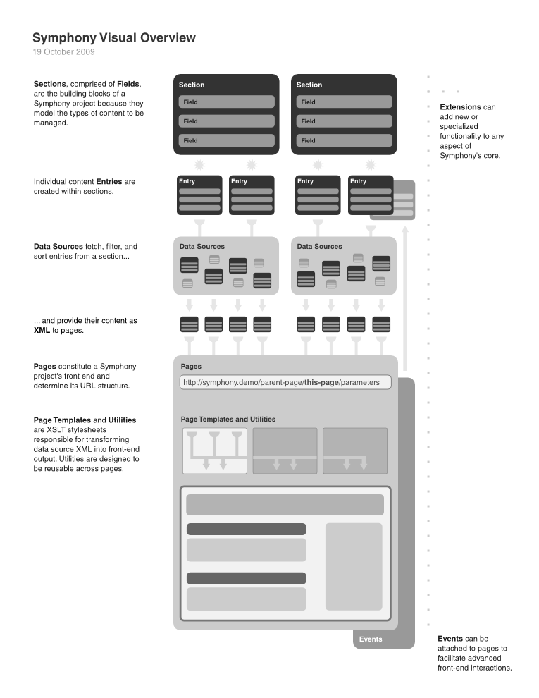
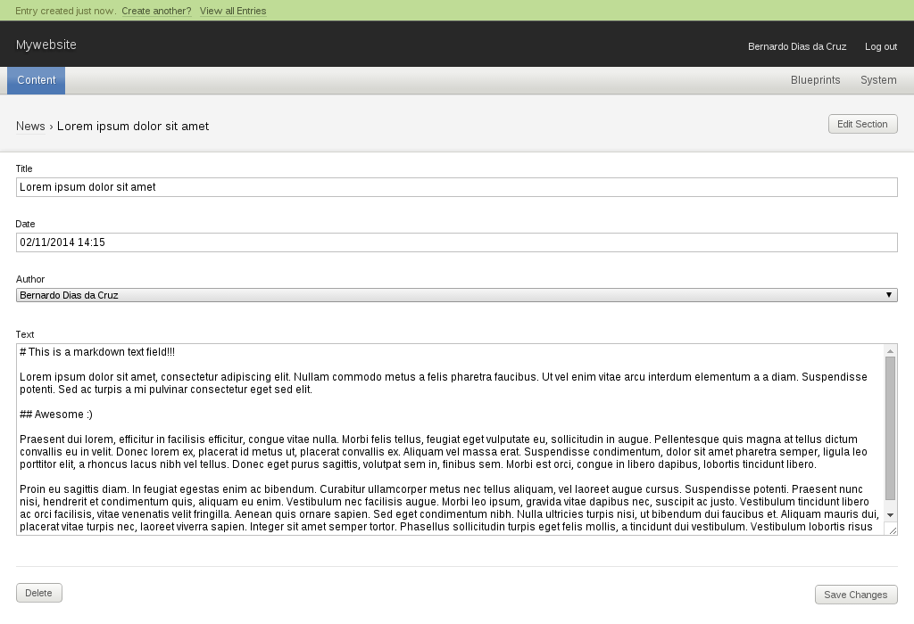
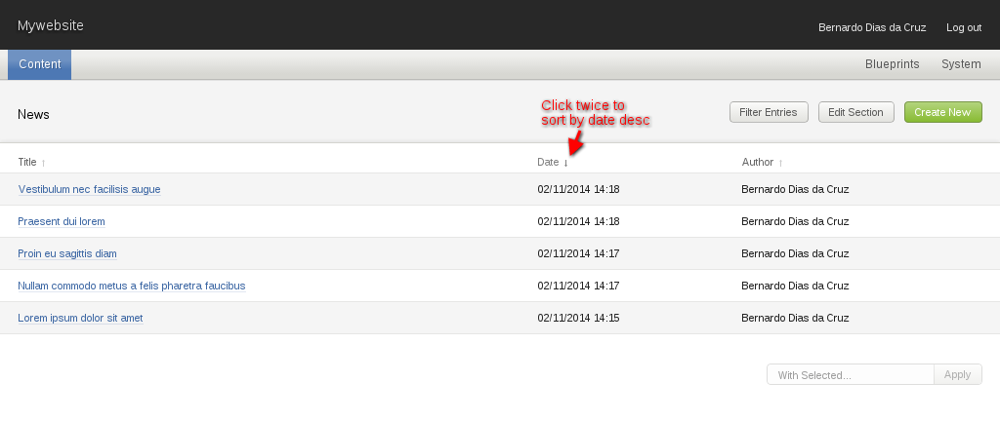
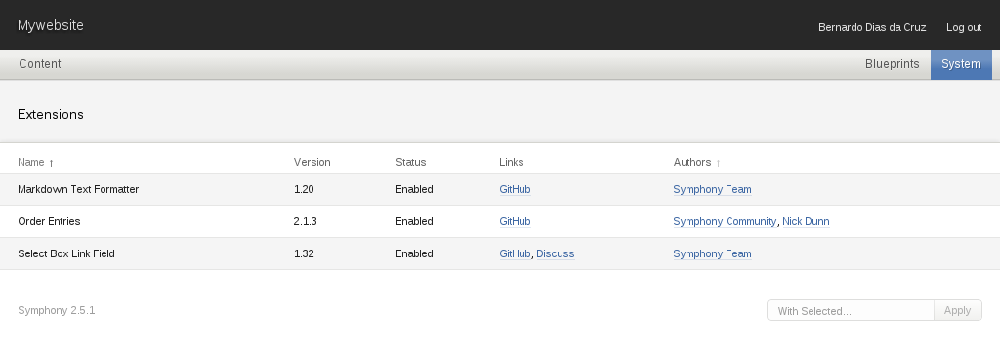
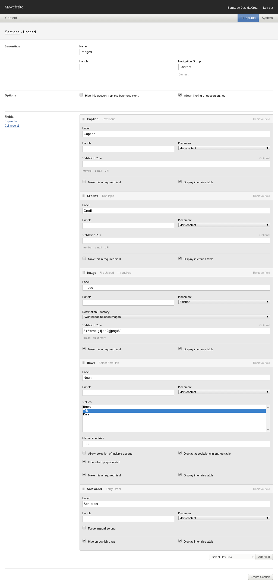
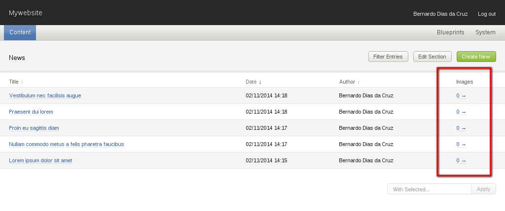
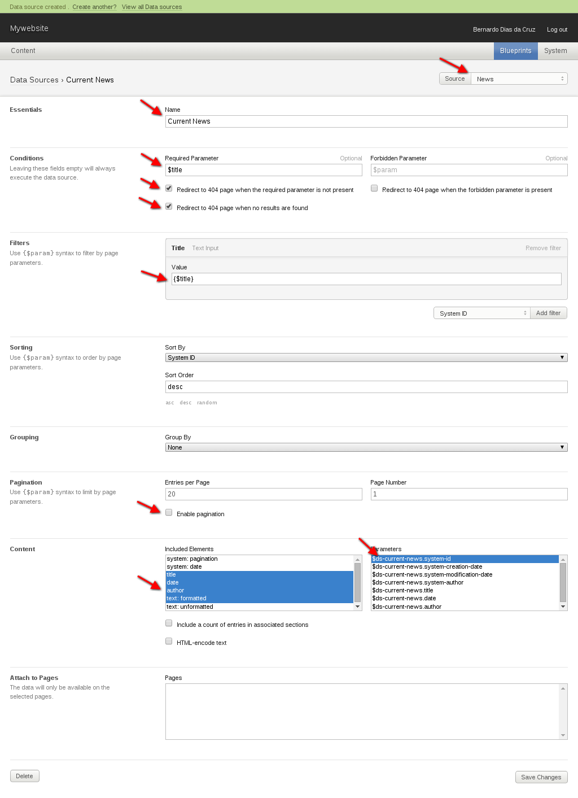
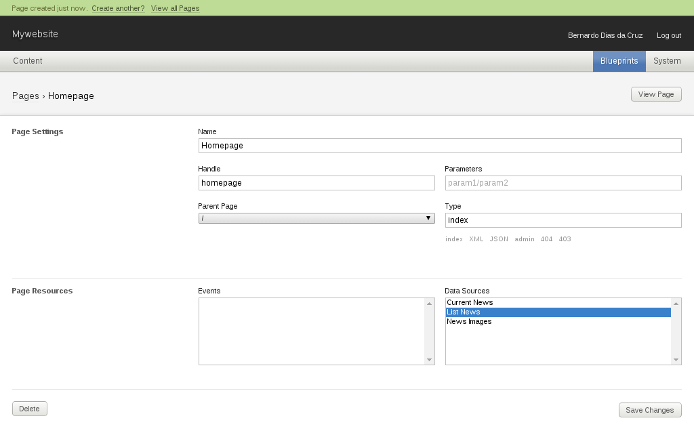

Symphony CMS 2.x.x Tutorial
=====

In this tutorial we'll build a fully administrable website from scratch with [Symphony CMS](http://www.getsymphony.com/).

__getsymphony.com__


Created by Allen Chang and Alistair Kearney for over a decade, Symphony is an Open Source XSLT-based CMS built in PHP and MySQL. But don't worry about programming languages yet, this CMS is very accessible even for designers. We'll focus our attention on the amazing concept of this tool and how easy and quick you can build an entire website with, wait for it, full control of your frontend.

> Symphony's features strike a perfect balance: the power to do everything you need, the intelligence to do only what you need.

_Before we start, make sure you understand that this is NOT a Symfony PHP Framework tutorial. Not even close. Ready?_ :)

So lets get started!


01. Setup enviroment
-----

To build with Symphony you'll need to make sure your server requirements match the following:

- PHP 5.3 or above
- PHP's LibXML module, with the XSLT extension enabled (--with-xsl)
- MySQL 5.0 or above
- An Apache webserver (can be used with others, but we'll focus on Apache server in this tutorial)
- Apache's mod_rewrite module or equivalent


02. Symphony CMS install
-----

Install Symphony is very easy. Can be done even in old-fashioned way with .zip files. We'll do, of course, in the cool way, with Git.

### I. Git clone

First step, go to [github.com/symphonycms/symphony-2](http://github.com/symphonycms/symphony-2) and clone the project in your server.


`git clone --depth=1 https://github.com/symphonycms/symphony-2.git mywebsite`

With the system files cloned, now open the project in your browser [http://localhost/mywebsite/](http://localhost/mywebsite/).

_We'll not use virtual hosts on this tutorial to keep it simple, so consider `http://localhost` as your Apache server root of public files, `/mywebsite` will be located there._

### II. Install wizard

In the __mywebsite__ URL you'll see the install wizard, this page is pretty informative, go on, fill up the fields and click `Install Symphony`. Ah, you'll need a DB for this project, make sure you have created one with the MySQL tool of your choice.



### III. Done!

All setup, ready to go!


03. Symphony administration
-----

### I. Login

Now go to your administration page, in this tutorial we'll use the default `/symphony` path, but as you saw in the wizard, you can choose any different path.


### II. Administration page

After login you'll see a pretty and clear administration page.


In Symphony we have some very well defined concepts to create the awesomeness. I'll explain the basics, but you can read more in the official Symphony website [concepts](http://www.getsymphony.com/learn/concepts/).

The developer tools are in these two sections on the right side of the main menu: __Blueprints__ and __System__. At this moment we really dont have any kind of content structure or pages. Like a blank piece of paper, we'll build based only on our project specification, and this is one big differential comparing to others CMSes.

```
- Blueprints
  - Pages
  - Sections
  - Data Sources
  - Events
- System
  - Authors
  - Preferences
  - Extensions
```

From Symphony [learn](http://www.getsymphony.com/learn/) page, the following infographic explains a lot of how Symphony works!



### III. Symphony Extensions

It's important to understand that Symphony are meant to be simple, and have a powerfull core to be extended by the community. For this we have tons of extensions for any kind of need. The core install have the basics, which is enough to do the basic, but for our tutorial we'll go further. We'll install extensions on demand as the tutorial evolves.

The official repository of extensions can be found in the [extensions](http://www.getsymphony.com/download/extensions/) section in Symphony website. While the official website is great and full of resources, few years ago [@nickdunn](http://twitter.com/nickdunn) buit a better extension repository named [symphonyextensions.com](http://symphonyextensions.com/), we'll use this one in this tutorial.


### IV. Files Structure

```
TBP!!!
```


04. Mywebsite backend
-----

It's time to have some fun. First of all we need to understand what we are doing. Lets imagine a very simple news website, the content structure should look like this:

```
- News
  - Title (one line text field)
  - Date (datetime field)
  - Text (textarea with markdown)
  - Author (author from the admin)
  - Images (gallery of images)
```

### I. Working with Sections

#### a) Creating the News Section

Go to `Blueprints > Sections > Create new` and create the __News__ section as the following:


At this moment we are not using any extension, so we just created the basic fields for the __News section__.

Now we need the Markdown formatter for the __Text field__, on your terminal, in the project root, run:

`git submodule add https://github.com/symphonycms/markdown.git extensions/markdown --recursive`

_(more information about this extension here: [Markdown Text Formatter](http://symphonyextensions.com/extensions/markdown/))_

Back to the administration go to `System > Extensions`, select `Markdown Text Formatter` and in the bottom right selectbox, choose `Install` then click `Apply`.


Go back to `Blueprints > Sections`, click on `News` and set the `Text Formatter` on the __Text field__ to `Markdown` and `Save changes`.


#### b) Filling News section with sample content

At this moment you already see the newly created section in the left side on main menu. To proceed in the development of this tutorial we'll create some content in that section.

Go to `Content > News`, you'll see an empty list of entries. That's fine, click on the green button `Create New`.


The greatest thing of Symphony is the administration interface, it's really simple!



After creating a few entries with sample content, you'll be able to see the entries list and sort as you want. What you see here is unrelated to frontend, as we'll see soon.



#### c) Creating the Images Section (linked sections)

You probably noticed that I didn't included any image field in the __News section__. If yes, cool, you are paying attention :)

So lets create a new section called __Images__, with some meta information like __caption__ and __credits__. But first we need to create a new folder to upload all image files of this section. On your terminal run `mkdir workspace/uploads && mkdir workspace/uploads/images`.

For this section we'll need 2 more extensions, to install, run:

`git submodule add https://github.com/symphonycms/selectbox_link_field.git extensions/selectbox_link_field --recursive`

_(more information at [Selectbox Link Field](http://symphonyextensions.com/extensions/selectbox_link_field/))_

`git submodule add https://github.com/symphonists/order_entries.git extensions/order_entries --recursive`

_(more information at [Order Entries](http://symphonyextensions.com/extensions/order_entries/))_

Now go to `System > Extensions` and install both. The __Selectbox Link Field__ will provide a new kind of field that is used to link on section to another. The __Order Entries__ is also a new field type to allow user sort entries by dragging the lines in the entries list.



Now go to `Blueprints > Sections` and `Create New` section as the following:



After create the __Images sections__, go to `Content > News` and spot the new column called `Images` on the right side. Click on the `0 →` link of any entry to create sample content linked to that entry.



#### d) Filling Images section with sample content

Create content is something really simple, as we see before. no big deal here too.

After creating some sample content, you'll be able to see in the __News Section__ entries list, in the __Images__ column something like `5 →` and when you click in this link you'll go to __Image Section__ entries list, but filtered only with related entries.


### II. Working with Data Sources

So far so good! At this point we already have a complete administration interface for CRUD/BREAD stuff. Now we'll jump in Data Sources!

Data Sources are filters to fetch entries from sections on demand. To create a new Data Source go to `Blueprints > Data Sources > Create New`.

For this example we need to know what we want in the frontend (getting there!). So, lets imagine the following specs: In the homepage of __mywebsite__ I want to see a list of all news with links for the news page. In the list, news should be sorted by date desc with date and title. In the news page I want to see all data of that news.

To accomplish this we'll need a few Data Sources, go to `Blueprints > Data Sources > Create New` and create the following:

- List News (fetch all News, sorted by date desc)
- Current News (fetch only the current news)
- News Images (fetch all images of the current news, sorted by sord order field desc)

#### a) List News

Select source __News__, sort by date desc, disable pagination to fetch all entries, select only title and date fields to output.


#### b) Current News

Select source __News__, set condition with required param `$title`, if this condition return false, redirect to a 404 page. Filter by the __Title field__ with `$title` param. Disable pagination to fetch all entries, select only title, date, author and text (formatted) to output. Also output `$ds-current-news.system-id` param with the results.

_We'll see where `$title` param come from in the next topic!_



#### c) News Images

Select source __Images__, Filter by the __News field__ (the Selectbox link field) with the `$ds-current-news.system-id` param from the __Current News__ Data Source, this is called chaining datasources. Sort by __Sord order field__ desc, disable pagination to fetch all entries, select only caption, credits and image fields to output.


### III. Working with Pages

Now it's time to create the routes and attach data sources. Following the specs we'll have two pages: __Homepage__ and __News__.

#### a) Homepage

Lets create the __Homepage__, this page is the only one with __Type__ `index`. To do this, go to `Blueprints > Pages`. While creating we'll also attach __List News__ Data Source on this page.



#### b) News

When creating the __News page__ we'll define the __Parameters__ with `title` value, this param is the `$title` used in the __Current News__ Data Source. We'll also attach __Current News__ and __News Images__ Data Sources in this page.


05. Mywebsite frontend
-----

