PHP Content Management System
=====

In this tutorial you'll learn how to install and build a administrable site from scratch.

- [01. Setup environment](#01-setup-environment)
- [02. Symphony CMS install](#02-symphony-cms-install)
  - [I. Git clone](#i-git-clone)
  - [II. Install wizard](#ii-install-wizard)
  - [III. Done!](#iii-done)
- [03. Symphony administration](#03-symphony-administration)
  - [I. Login](#i-login)
  - [II. Administration page](#ii-administration-page)
  - [III. Symphony Extensions](#iii-symphony-extensions)
  - [IV. Files Structure](#iv-files-structure)
- [04. Mywebsite backend](#04-mywebsite-backend)
  - [I. Working with Sections](#i-working-with-sections)
  - [II. Working with Data Sources](#ii-working-with-data-sources)
  - [III. Working with Pages](#iii-working-with-pages)
- [05. Mywebsite frontend](#05-mywebsite-frontend)
  - [I. Homepage](#i-homepage)
  - [II. News page](#ii-news-page)
  - [III. Improving News page output](#iii-improving-news-page-output)
- [06. Mywebsite ensemble](#06-mywebsite-ensemble)
- [07. Your turn!](#07-your-turn)
- [About Symphony CMS](#about-symphony-cms)

_Before we start, make sure you understand that **SymphonyCMS** is NOT about **Symfony PHP Framework**. They're not the same thing. Ready?_ :)

The result of this tutorial can be done in ~1h of development.

Open an issue if you have any question. Good reading!


01. Setup environment
-----

To build with Symphony you'll need to make sure your server meets the following requirements:

- PHP 5.3 or above
- PHP's LibXML module, with the XSLT extension enabled (--with-xsl)
- MySQL 5.0 or above
- An Apache webserver (can be used with others, but we'll focus on Apache server in this tutorial)
- Apache's mod_rewrite module or equivalent


02. Symphony CMS install
-----

Installing Symphony is very easy. Can be done even in old-fashioned way with .zip files. We'll do, of course, in the cool way, with Git.

### I. Git clone

First step, go to [github.com/symphonycms/symphony-2](http://github.com/symphonycms/symphony-2) and clone the project in your server.

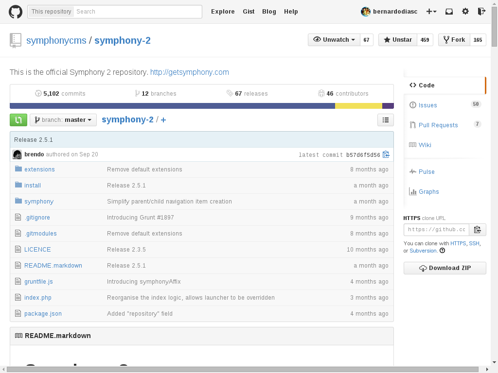

`git clone --depth=1 https://github.com/symphonycms/symphony-2.git mywebsite`

With the system files cloned, now open the project in your browser [http://localhost/mywebsite/](http://localhost/mywebsite/).

_We'll not use virtual hosts on this tutorial to keep it simple, so with `http://localhost` as your Apache server root of public files, `/mywebsite` will be located there._

### II. Install wizard

In the __mywebsite__ URL you'll see the install wizard. This page is pretty informative, so go on and fill out the fields. Finally click `Install Symphony`. You'll need a DB for this project, so make sure you have created one with the MySQL tool of your choice.


### III. Done!

All set up, ready to go!

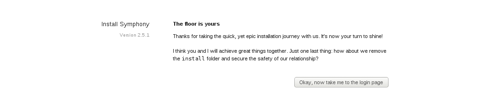


03. Symphony administration
-----

### I. Login

Now go to your administration page. In this tutorial we'll use the default `/symphony` path, but as you saw in the wizard you can choose any different path.


### II. Administration page

After login you'll see a pretty and clear administration page.

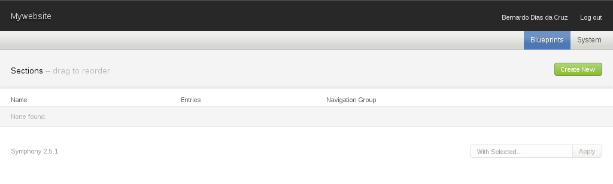

In Symphony we have some very well defined concepts to create the awesomeness. I'll explain the basics and you can read more in the official Symphony website [concepts](http://www.getsymphony.com/learn/concepts/).

The developer tools are in these two sections on the right side of the main menu: __Blueprints__ and __System__. At this moment we really don't have any kind of content structure or pages. Like a blank piece of paper, we'll build based only on our project specification. This is one big difference in approach compared to other CMS's.

```
- Blueprints
  - Pages
  - Sections
  - Data Sources
  - Events
- System
  - Authors
  - Preferences
  - Extensions
```

From Symphony [learn](http://www.getsymphony.com/learn/) page, the following infographic explains a lot of how Symphony works!


### III. Symphony Extensions

It's important to understand that Symphony is meant to be simple, and have a powerful core to be extended by the community. For this we have tonnes of extensions to fill any kind of need. The core install has the essentials, but for our tutorial we'll go further. We'll install extensions on demand as the tutorial progresses.

The official repository of extensions can be found in the [extensions](http://www.getsymphony.com/download/extensions/) section in Symphony website. While the official website is great and full of resources, a few years ago [@nickdunn](http://twitter.com/nickdunn) built a better extension repository named [symphonyextensions.com](http://symphonyextensions.com/). We'll use this one for the tutorial.

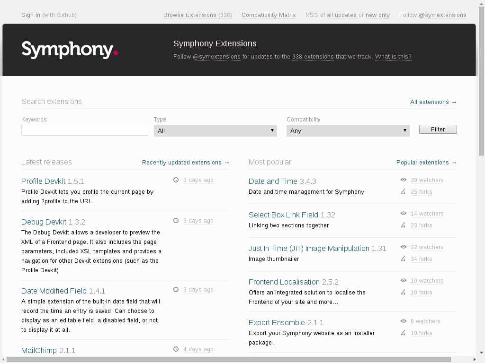

### IV. Files Structure

```
mywebsite
├── extensions (all extensions go here)
├── install (installation files, for security reasons you'll want to drop off this after installation)
├── manifest (stuff, cache, log, temp files and the config.php, this is the kind of folder you include in the .gitignore)
├── symphony (the SymphonyCMS system files)
└── workspace (here is where lives all the frontend fun, your project goes here and here you'll work mostly of the time)
    ├── data-sources (each data source is a php file from here)
    ├── events (each event is a php file from here)
    ├── pages (each page is a xsl file from here)
    └── utilities (you can use this folder to include all xsl templates useful in your project)
```


04. Mywebsite backend
-----

It's time to have some fun. First of all we need to understand what we are doing. Lets imagine a very simple news website, with a content structure like this:

```
- News
  - Title (one line text field)
  - Date (datetime field)
  - Text (textarea with markdown)
  - Author (author from the admin)
  - Images (gallery of images)
```

### I. Working with Sections

#### a) Creating the News Section

Go to `Blueprints > Sections > Create new` and create the __News__ section as the following:


At this moment we are not using any extensions so we just created the basic fields for the __News section__.

Now we need the Markdown formatter for the __Text field__. In your terminal, navigate to the project root and run:

`git submodule add https://github.com/symphonycms/markdown.git extensions/markdown --recursive`

_(more information about this extension here: [Markdown Text Formatter](http://symphonyextensions.com/extensions/markdown/))_

Back in the administration go to `System > Extensions`, select `Markdown Text Formatter` and in the bottom right selectbox, choose `Install` then click `Apply`.

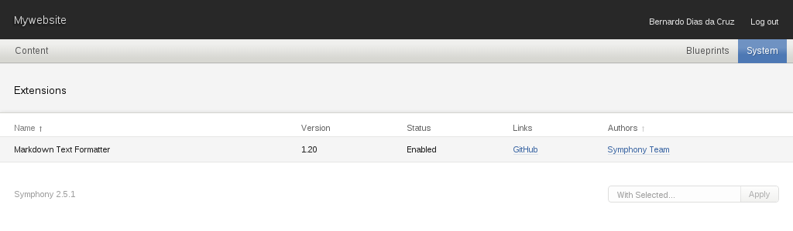

Go back to `Blueprints > Sections`, click on `News` and set the `Text Formatter` on the __Text field__ to `Markdown` and `Save changes`.

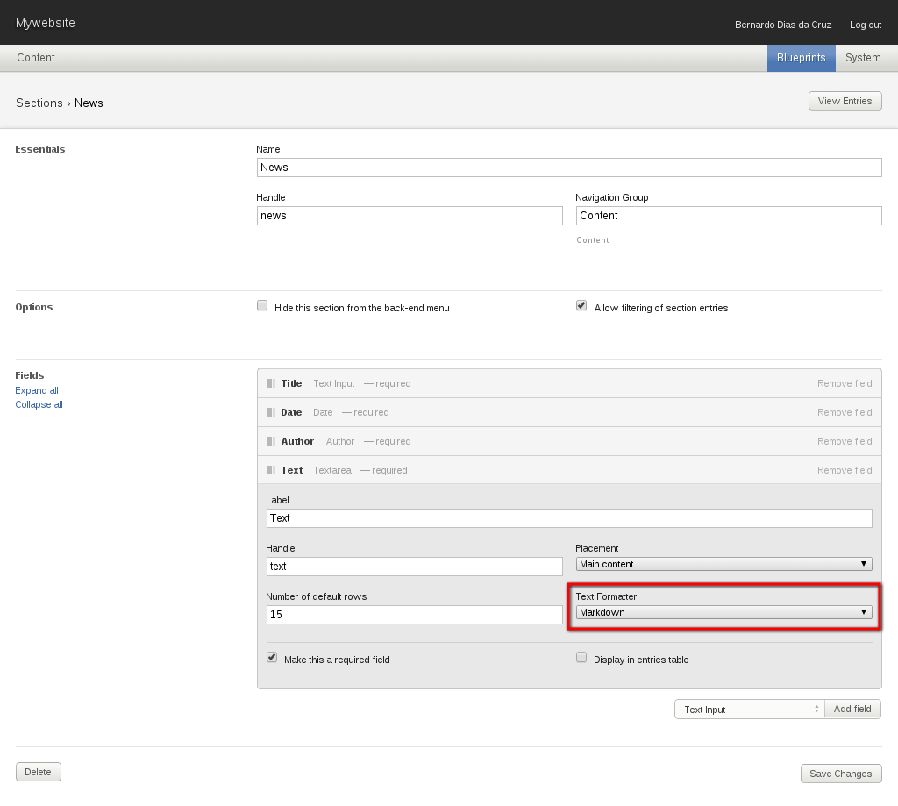

#### b) Filling News section with sample content

At this moment you already see the newly created section in the left side on main menu. Next we'll create some content in that section.

Go to `Content > News` and you'll see an empty list of entries. Click on the green button `Create New`.

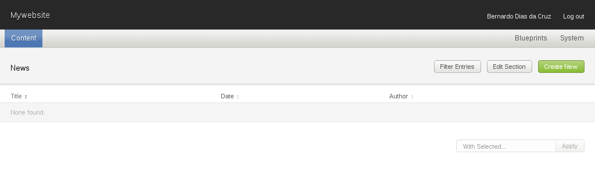

By now you'll be starting to understand why I love the Symphony administration interface: it's really simple!


After creating a few entries with sample content you'll be able to see the entries list and sort entries as you want. This doesn't affect anything on the frontend, we'll be getting to that soon.


#### c) Creating the Images Section (linked sections)

Did you notice that I didn't include any image field in the __News section__. You did? Cool, you are paying attention :)

So lets create a new section called __Images__ with some meta information like __caption__ and __credits__. But first we need to create a new folder to upload all image files of this section. On your terminal run `mkdir workspace/uploads && mkdir workspace/uploads/images`.

For this section we'll need 2 more extensions. To install, run:

`git submodule add https://github.com/symphonycms/selectbox_link_field.git extensions/selectbox_link_field --recursive`

_(more information at [Selectbox Link Field](http://symphonyextensions.com/extensions/selectbox_link_field/))_

`git submodule add https://github.com/symphonists/order_entries.git extensions/order_entries --recursive`

_(more information at [Order Entries](http://symphonyextensions.com/extensions/order_entries/))_

Now go to `System > Extensions` and install both. The __Selectbox Link Field__ will provide a new kind of field that is used to link one section to another. The __Order Entries__ is also a new field type to allow sorting of entries by dragging the lines in the entries list.


Now go to `Blueprints > Sections` and `Create New` section:


After creating the __Images sections__, go to `Content > News`. See the new column called `Images` on the right side? Click on the `0 →` link of any entry to create sample content linked to that entry.


#### d) Filling Images section with sample content

Creating content is really straightforward, as we saw before. No big deal here either.

After creating some sample content, take a look in the __Images__ column of the __News Section__ entries list. You'll see something like `5 →`. Clicking this link takes you to the __Image Section__ entries list, filtered to display only related entries.

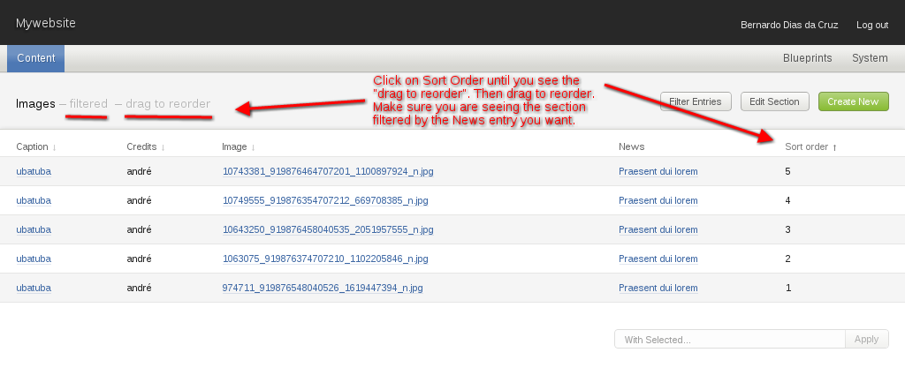

### II. Working with Data Sources

So far so good! At this point we already have a complete administration interface for CRUD/BREAD stuff. Now we'll jump into Data Sources!

Data Sources are filters to fetch entries from sections on demand. To create a new Data Source go to `Blueprints > Data Sources > Create New`.

Before going further here we first need an idea of we want in the frontend. So lets imagine the following specs: In the homepage of __mywebsite__ I want to see a list of all news with links for the news page. In the list, news should be sorted by date (newest first) with date and title. In the news page I want to see all data of that news.

To accomplish this we'll need a few Data Sources. Go to `Blueprints > Data Sources > Create New` and create the following:

- List News (fetch all News, sorted by date desc)
- Current News (fetch only the current news)
- News Images (fetch all images of the current news, sorted by sort order field desc)

#### a) List News

- Select source __News__ and sort by date desc.
- Disable pagination to fetch all entries.
- Select only title and date fields to output.

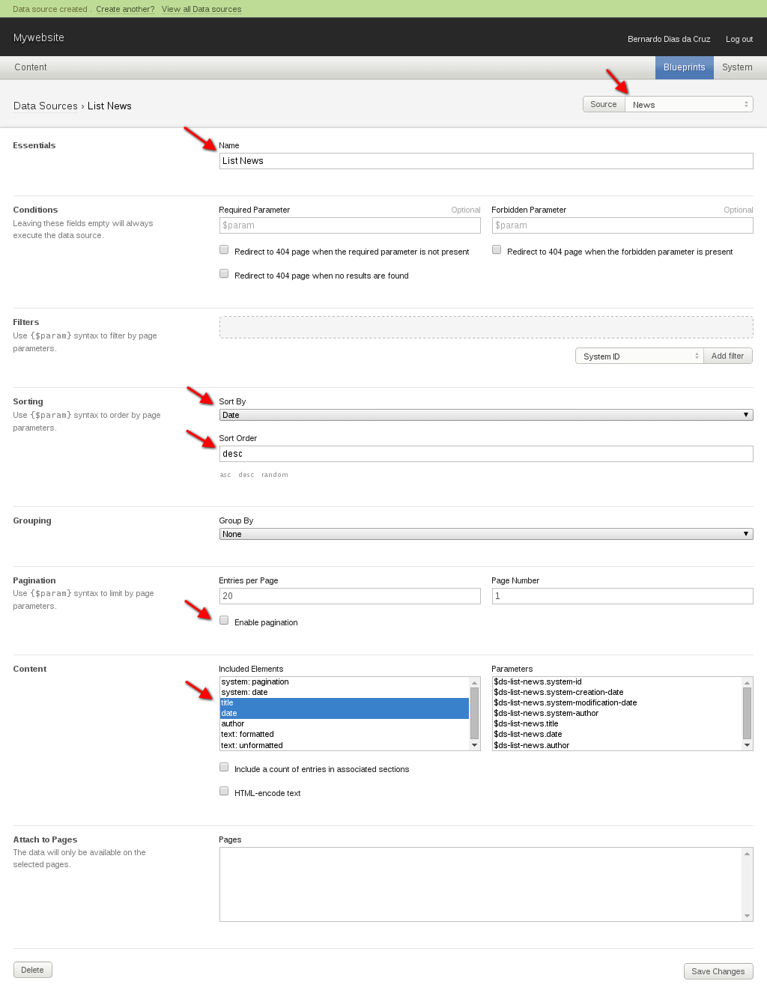

#### b) Current News

- Select source __News__ and set condition with required param `$title`.
- If this condition return false redirect to a 404 page.
- Filter by the __Title field__ with `$title` param.
- Disable pagination to fetch all entries.
- Select only title, date, author and text (formatted) to output.
- Also output `$ds-current-news.system-id` param with the results.

_Not sure where the `$title` param comes from? Hang in there, we'll see in the next section!_


#### c) News Images

- Select source __Images__.
- Filter by the __News field__ (the Selectbox link field) with the `$ds-current-news.system-id` param from the __Current News__ Data Source. This is called chaining datasources.
- Sort by __Sort order field__ desc.
- Disable pagination to fetch all entries.
- Select only caption, credits and image fields to output.

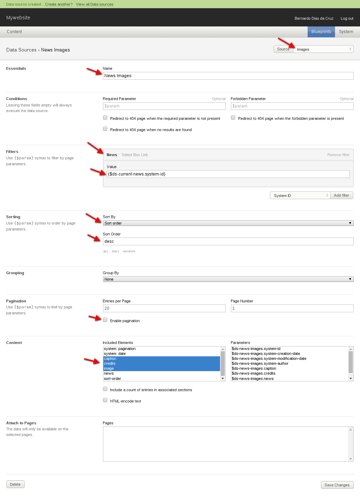

#### d) List of Data Sources

This is how `Blueprints > Data Sources` looks now:

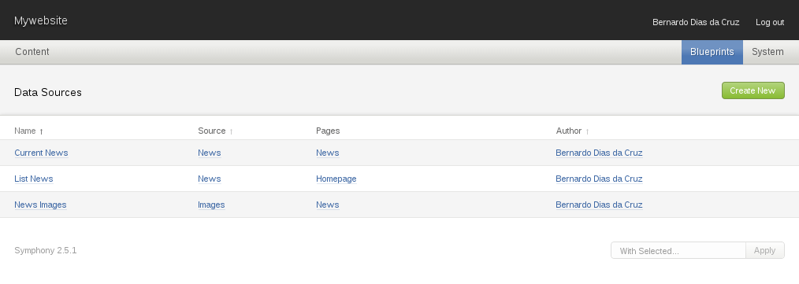

### III. Working with Pages

Now it's time to create the routes and attach data sources. Following the specs we'll have two pages: __Homepage__ and __News__.

#### a) Homepage

Lets create the __Homepage__ first. This page is the only one with __Type__ `index`. To do this, go to `Blueprints > Pages`. While creating we'll also attach __List News__ Data Source on this page.


#### b) News

When creating the __News page__ we'll define the __Parameters__ with `title` value. This param is the `$title` used in the __Current News__ Data Source. We'll also attach __Current News__ and __News Images__ Data Sources in this page.

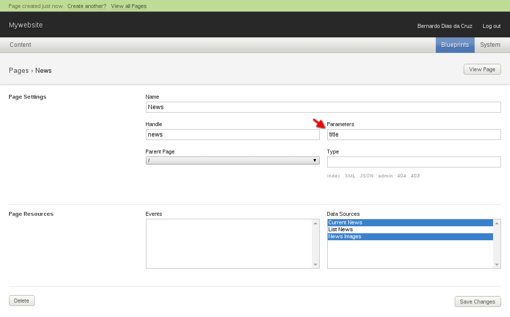

#### c) List of Pages

Now we have `Blueprints > Pages` looking like this:

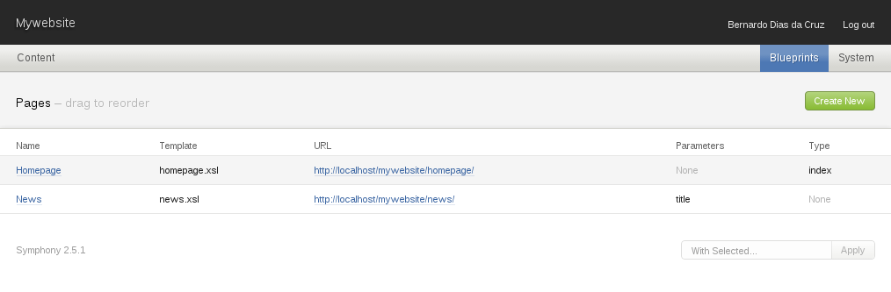


05. Mywebsite frontend
-----

Now lets start our frontend!

Symphony retrieves data from the Data Sources as XML and transforms it to HTML using XSLT. XSLT is a template engine language that is very easy to learn once you get the basics. I'll show you how to get started.

First thing we need now is to install the [Debug Devkit](http://symphonyextensions.com/extensions/debugdevkit/) extensions to see what's under the hood of these pages.

`git submodule add https://github.com/symphonycms/debugdevkit.git extensions/debugdevkit --recursive`

### I. Homepage

Now open your homepage [`http://localhost/mywebsite`](http://localhost/mywebsite)!

You'll see a blank page with just an `<h1>` for the page title. Perfect. Open the `/workspace/pages/homepage.xsl` and you'll see the following:

#### a) Default homepage.xsl

```xml
<?xml version="1.0" encoding="UTF-8"?>
<xsl:stylesheet version="1.0"
  xmlns:xsl="http://www.w3.org/1999/XSL/Transform">

<xsl:output method="xml"
  doctype-public="-//W3C//DTD XHTML 1.0 Strict//EN"
  doctype-system="http://www.w3.org/TR/xhtml1/DTD/xhtml1-strict.dtd"
  omit-xml-declaration="yes"
  encoding="UTF-8"
  indent="yes" />

<xsl:template match="/">
  <h1><xsl:value-of select="/data/params/page-title"/></h1>
</xsl:template>

</xsl:stylesheet>
```

#### b) Homepage `?debug`

Now open the debug devkit adding `?debug` in the URL [`http://localhost/mywebsite/?debug`](http://localhost/mywebsite/?debug), and in the XML tab you'll see the following:

```xml
<?xml version="1.0" encoding="utf-8" ?>
<data>
    <params>
        <today>2014-11-05</today>
        <current-time>22:47</current-time>
        <this-year>2014</this-year>
        <this-month>11</this-month>
        <this-day>05</this-day>
        <timezone>-02:00</timezone>
        <website-name>Mywebsite</website-name>
        <page-title>Homepage</page-title>
        <root>http://localhost/mywebsite</root>
        <workspace>http://localhost/mywebsite/workspace</workspace>
        <http-host>localhost</http-host>
        <root-page>homepage</root-page>
        <current-page>homepage</current-page>
        <current-page-id>1</current-page-id>
        <current-path>/</current-path>
        <parent-path>/</parent-path>
        <current-query-string><![CDATA[debug]]></current-query-string>
        <current-url>http://localhost/mywebsite</current-url>
        <upload-limit>5242880</upload-limit>
        <symphony-version>2.5.1</symphony-version>
        <cookie-xsrf-token>5N/oAkCRtT8xqfarmBUlR2l/5Sg</cookie-xsrf-token>
        <cookie-username>bernardo</cookie-username>
        <cookie-pass>PBKDF2v1|10000|d9b1ac45e1f9ab5ad3ee|9YBlZEEMSI0/95e7PIDmJFPXtfxh5k/600rk5ppPdxMO9HHRNUy0Ag==</cookie-pass>
        <page-types>
            <item handle="index">index</item>
        </page-types>
        <page-events></page-events>
    </params>
    <events />
    <list-news>
        <section id="1" handle="news">News</section>
        <entry id="4">
            <title handle="vestibulum-nec-facilisis-augue">Vestibulum nec facilisis augue</title>
            <date iso="2014-11-02T14:18:00-02:00" timestamp="1414945080" time="14:18" weekday="7" offset="-0200">2014-11-02</date>
        </entry>
        <entry id="5">
            <title handle="praesent-dui-lorem">Praesent dui lorem</title>
            <date iso="2014-11-02T14:18:00-02:00" timestamp="1414945080" time="14:18" weekday="7" offset="-0200">2014-11-02</date>
        </entry>
        <entry id="2">
            <title handle="proin-eu-sagittis-diam">Proin eu sagittis diam</title>
            <date iso="2014-11-02T14:17:00-02:00" timestamp="1414945020" time="14:17" weekday="7" offset="-0200">2014-11-02</date>
        </entry>
        <entry id="3">
            <title handle="nullam-commodo-metus-a-felis-pharetra-faucibus">Nullam commodo metus a felis pharetra faucibus</title>
            <date iso="2014-11-02T14:17:00-02:00" timestamp="1414945020" time="14:17" weekday="7" offset="-0200">2014-11-02</date>
        </entry>
        <entry id="1">
            <title handle="lorem-ipsum-dolor-sit-amet">Lorem ipsum dolor sit amet</title>
            <date iso="2014-11-02T14:15:00-02:00" timestamp="1414944900" time="14:15" weekday="7" offset="-0200">2014-11-02</date>
        </entry>
    </list-news>
</data>
```

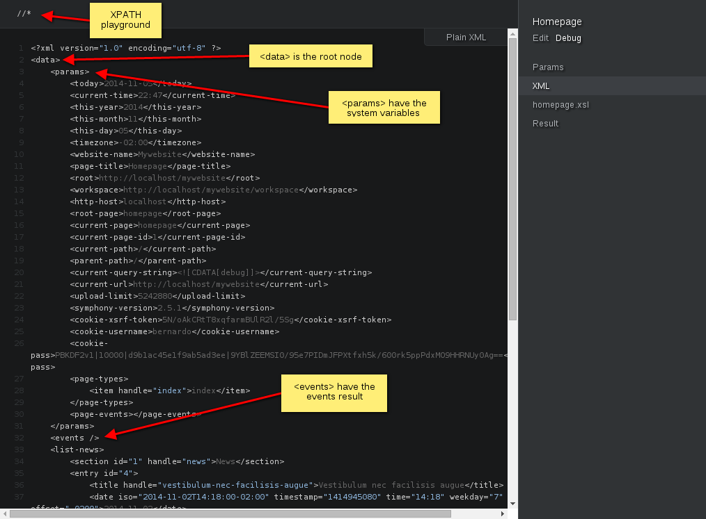

#### c) Edited homepage.xsl

What matters here is the `<list-news>` node, which is the result of the [List News](#a-list-news) Data Source. Now we'll make a list with this data using __XPath__ in the `/workspace/pages/homepage.xsl`, and the file will look like this:

```xml
<?xml version="1.0" encoding="UTF-8"?>
<xsl:stylesheet version="1.0"
  xmlns:xsl="http://www.w3.org/1999/XSL/Transform">

<xsl:output method="xml"
  doctype-public="-//W3C//DTD XHTML 1.0 Strict//EN"
  doctype-system="http://www.w3.org/TR/xhtml1/DTD/xhtml1-strict.dtd"
  omit-xml-declaration="yes"
  encoding="UTF-8"
  indent="yes" />

<xsl:template match="/">
  <ul>
    <xsl:for-each select="data/list-news/entry">
      <li>
        <a href="{/data/params/root}/news/{title/@handle}"><xsl:value-of select="title"/></a>
      </li>
    </xsl:for-each>
  </ul>
</xsl:template>

</xsl:stylesheet>
```

#### c) Homepage output

And the HTML output will be:

```html
<!DOCTYPE ul PUBLIC "-//W3C//DTD XHTML 1.0 Strict//EN" "http://www.w3.org/TR/xhtml1/DTD/xhtml1-strict.dtd">
<ul>
  <li>
    <a href="http://localhost/mywebsite/news/vestibulum-nec-facilisis-augue">Vestibulum nec facilisis augue</a>
  </li>
  <li>
    <a href="http://localhost/mywebsite/news/praesent-dui-lorem">Praesent dui lorem</a>
  </li>
  <li>
    <a href="http://localhost/mywebsite/news/proin-eu-sagittis-diam">Proin eu sagittis diam</a>
  </li>
  <li>
    <a href="http://localhost/mywebsite/news/nullam-commodo-metus-a-felis-pharetra-faucibus">Nullam commodo metus a felis pharetra faucibus</a>
  </li>
  <li>
    <a href="http://localhost/mywebsite/news/lorem-ipsum-dolor-sit-amet">Lorem ipsum dolor sit amet</a>
  </li>
</ul>
```

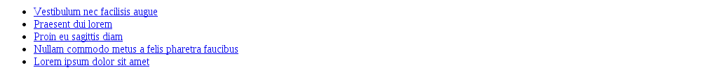

### II. News page

Clicking on any of these links takes you to the __News__ page, which is the file `/workspace/pages/news.xsl`. First lets see what XML we have attached in this page. Click on any link and add `?debug` in the URL [`http://localhost/mywebsite/news/vestibulum-nec-facilisis-augue/?debug`](http://localhost/mywebsite/news/vestibulum-nec-facilisis-augue/?debug):

#### a) News page ?debug

```xml
<?xml version="1.0" encoding="utf-8" ?>
<data>
    <params>
        <today>2014-11-05</today>
        <current-time>23:24</current-time>
        <this-year>2014</this-year>
        <this-month>11</this-month>
        <this-day>05</this-day>
        <timezone>-02:00</timezone>
        <website-name>Mywebsite</website-name>
        <page-title>News</page-title>
        <root>http://localhost/mywebsite</root>
        <workspace>http://localhost/mywebsite/workspace</workspace>
        <http-host>localhost</http-host>
        <root-page>news</root-page>
        <current-page>news</current-page>
        <current-page-id>2</current-page-id>
        <current-path>/news/praesent-dui-lorem</current-path>
        <parent-path>/</parent-path>
        <current-query-string><![CDATA[debug]]></current-query-string>
        <current-url>http://localhost/mywebsite/news/praesent-dui-lorem</current-url>
        <upload-limit>5242880</upload-limit>
        <symphony-version>2.5.1</symphony-version>
        <title>praesent-dui-lorem</title>
        <cookie-xsrf-token>5N/oAkCRtT8xqfarmBUlR2l/5Sg</cookie-xsrf-token>
        <cookie-username>bernardo</cookie-username>
        <cookie-pass>PBKDF2v1|10000|d9b1ac45e1f9ab5ad3ee|9YBlZEEMSI0/95e7PIDmJFPXtfxh5k/600rk5ppPdxMO9HHRNUy0Ag==</cookie-pass>
        <page-types />
        <page-events></page-events>
        <ds-current-news.system-id>
            <item handle="5">5</item>
        </ds-current-news.system-id>
        <ds-current-news>
            <item handle="5">5</item>
        </ds-current-news>
    </params>
    <events />
    <current-news>
        <section id="1" handle="news">News</section>
        <entry id="5">
            <title handle="praesent-dui-lorem">Praesent dui lorem</title>
            <date iso="2014-11-02T14:18:00-02:00" timestamp="1414945080" time="14:18" weekday="7" offset="-0200">2014-11-02</date>
            <author>
                <item id="1" handle="bernardo-dias-da-cruz" username="bernardo">Bernardo Dias da Cruz</item>
            </author>
            <text mode="formatted">
                <h1>Yey!</h1>
                <p><strong>Praesent dui lorem</strong>, efficitur in facilisis efficitur, congue vitae nulla. Morbi felis tellus, feugiat eget vulputate eu, sollicitudin in augue. Pellentesque quis magna at tellus dictum convallis eu in velit. Donec lorem ex, placerat id metus ut, placerat convallis ex. Aliquam vel massa erat. Suspendisse condimentum, dolor sit amet pharetra semper, ligula leo porttitor elit, a rhoncus lacus nibh vel tellus. Donec eget purus sagittis, volutpat sem in, finibus sem. Morbi est orci, congue in libero dapibus, lobortis tincidunt libero.</p>
                <p>Vestibulum nec facilisis augue. Morbi leo ipsum, gravida vitae dapibus nec, suscipit ac justo. Vestibulum tincidunt libero ac orci facilisis, vitae venenatis velit fringilla. Aenean quis ornare sapien. Sed eget condimentum nibh. Nulla ultricies turpis nisi, ut bibendum dui faucibus et. Aliquam mauris dui, placerat vitae turpis nec, laoreet viverra sapien. Integer sit amet semper tortor. Phasellus sollicitudin turpis eget felis mollis, a tincidunt dui vestibulum. Vestibulum lobortis risus ac nisi facilisis viverra.</p>
                <p>Proin eu sagittis diam. In feugiat egestas enim ac bibendum. Curabitur ullamcorper metus nec tellus aliquam, vel laoreet augue cursus. Suspendisse potenti. Praesent nunc nisi, hendrerit et condimentum quis, aliquam eu enim.</p>
                <p>Lorem ipsum dolor sit amet, consectetur adipiscing elit. Nullam commodo metus a felis pharetra faucibus. Ut vel enim vitae arcu interdum elementum a a diam. Suspendisse potenti. Sed ac turpis a mi pulvinar consectetur eget sed elit.</p>
            </text>
        </entry>
    </current-news>
    <news-images>
        <section id="2" handle="images">Images</section>
        <entry id="12">
            <caption handle="ubatuba">ubatuba</caption>
            <credits handle="andre">andré</credits>
            <image size="77 KB" bytes="79103" path="/uploads/images" type="image/jpeg">
                <filename>10743381_919876464707201_1100897924_n.jpg</filename>
                <meta creation="2014-11-02T15:11:24-02:00" width="960" height="720" />
            </image>
        </entry>
        <entry id="13">
            <caption handle="ubatuba">ubatuba</caption>
            <credits handle="andre">andré</credits>
            <image size="53 KB" bytes="54582" path="/uploads/images" type="image/jpeg">
                <filename>10749555_919876354707212_669708385_n.jpg</filename>
                <meta creation="2014-11-02T15:11:36-02:00" width="960" height="720" />
            </image>
        </entry>
        <entry id="11">
            <caption handle="ubatuba">ubatuba</caption>
            <credits handle="andre">andré</credits>
            <image size="75 KB" bytes="77705" path="/uploads/images" type="image/jpeg">
                <filename>10643250_919876458040535_2051957555_n.jpg</filename>
                <meta creation="2014-11-02T15:11:02-02:00" width="960" height="720" />
            </image>
        </entry>
        <entry id="10">
            <caption handle="ubatuba">ubatuba</caption>
            <credits handle="andre">andré</credits>
            <image size="38 KB" bytes="39575" path="/uploads/images" type="image/jpeg">
                <filename>1063075_919876374707210_1102205846_n.jpg</filename>
                <meta creation="2014-11-02T15:10:35-02:00" width="960" height="720" />
            </image>
        </entry>
        <entry id="9">
            <caption handle="ubatuba">ubatuba</caption>
            <credits handle="andre">andré</credits>
            <image size="127 KB" bytes="130549" path="/uploads/images" type="image/jpeg">
                <filename>974711_919876548040526_1619447394_n.jpg</filename>
                <meta creation="2014-11-02T15:10:30-02:00" width="960" height="720" />
            </image>
        </entry>
    </news-images>
</data>
```

Spot the `<ds-current-news.system-id>` inside `<params>`? That node has a list with all entry IDs from the __Current News__ Data Source. This is the param we used to link and filter the __News Images__ Data Source. Below in the XML you'll see `<current-news>` and `<news-images>` nodes resulted from Data Sources respectively.

#### b) Edited news.xsl

After editing our `/workspace/pages/news.xsl` file it will look like this:

```xml
<?xml version="1.0" encoding="UTF-8"?>
<xsl:stylesheet version="1.0"
  xmlns:xsl="http://www.w3.org/1999/XSL/Transform">

<xsl:output method="xml"
  doctype-public="-//W3C//DTD XHTML 1.0 Strict//EN"
  doctype-system="http://www.w3.org/TR/xhtml1/DTD/xhtml1-strict.dtd"
  omit-xml-declaration="yes"
  encoding="UTF-8"
  indent="yes" />

<xsl:template match="/">
  <h1><xsl:value-of select="data/current-news/entry/title"/></h1>
  <p><xsl:value-of select="data/current-news/entry/date"/></p>
  <p><xsl:value-of select="data/current-news/entry/author/item"/></p>
  <xsl:value-of select="data/current-news/entry/text"/>

  <ul>
    <xsl:for-each select="data/news-images/entry">
      <li>
        
        <br/>
        <xsl:value-of select="caption"/>
        <br/>
        <xsl:value-of select="credits"/>
        <hr/>
      </li>
    </xsl:for-each>
  </ul>
</xsl:template>

</xsl:stylesheet>
```
#### b) News page output

Yey! We have our news page with all content from the system. The HTML output contains just what you would expect:

```html
<!DOCTYPE h1 PUBLIC "-//W3C//DTD XHTML 1.0 Strict//EN" "http://www.w3.org/TR/xhtml1/DTD/xhtml1-strict.dtd">
<h1>Praesent dui lorem</h1><p>2014-11-02</p><p>Bernardo Dias da Cruz</p>Yey!

Praesent dui lorem, efficitur in facilisis efficitur, congue vitae nulla. Morbi felis tellus, feugiat eget vulputate eu, sollicitudin in augue. Pellentesque quis magna at tellus dictum convallis eu in velit. Donec lorem ex, placerat id metus ut, placerat convallis ex. Aliquam vel massa erat. Suspendisse condimentum, dolor sit amet pharetra semper, ligula leo porttitor elit, a rhoncus lacus nibh vel tellus. Donec eget purus sagittis, volutpat sem in, finibus sem. Morbi est orci, congue in libero dapibus, lobortis tincidunt libero.

Vestibulum nec facilisis augue. Morbi leo ipsum, gravida vitae dapibus nec, suscipit ac justo. Vestibulum tincidunt libero ac orci facilisis, vitae venenatis velit fringilla. Aenean quis ornare sapien. Sed eget condimentum nibh. Nulla ultricies turpis nisi, ut bibendum dui faucibus et. Aliquam mauris dui, placerat vitae turpis nec, laoreet viverra sapien. Integer sit amet semper tortor. Phasellus sollicitudin turpis eget felis mollis, a tincidunt dui vestibulum. Vestibulum lobortis risus ac nisi facilisis viverra.

Proin eu sagittis diam. In feugiat egestas enim ac bibendum. Curabitur ullamcorper metus nec tellus aliquam, vel laoreet augue cursus. Suspendisse potenti. Praesent nunc nisi, hendrerit et condimentum quis, aliquam eu enim.

Lorem ipsum dolor sit amet, consectetur adipiscing elit. Nullam commodo metus a felis pharetra faucibus. Ut vel enim vitae arcu interdum elementum a a diam. Suspendisse potenti. Sed ac turpis a mi pulvinar consectetur eget sed elit.
<ul>
  <li><br />ubatuba<br />andré<hr /></li>
  <li><br />ubatuba<br />andré<hr /></li>
  <li><br />ubatuba<br />andré<hr /></li>
  <li><br />ubatuba<br />andré<hr /></li>
  <li><br />ubatuba<br />andré<hr /></li>
</ul>
```


### III. Improving News page output

But wait... Despite being unstyled (this is not a CSS tutorial, so we'll skip that part for now), the content format is wrong!!! Well, kinda wrong, we need to go deeper into the XSLT to see how we can make it better.

Let's grab some XSLT templates from SymphonyCMS website [Utilities](http://www.getsymphony.com/download/xslt-utilities/) section. We need to:

- Fix the date format,
- Fix the text output (we should see HTML instead of raw Markdown),
- Remove the inline width from images and resize it on the server side.

Let's handle those things one by one now:

#### a) Fix the date format

For the date we want to use something like `2nd November, 2014` instead `2014-11-02`. To accomplish this we'll need a date format template that can be found in the official website. In the __XSLT Utilities__ section look for [Format Date/Time Advanced](http://www.getsymphony.com/download/xslt-utilities/view/20744/).

Copy the raw code in `/workspace/utilities/format-date.xsl` and include this file in the `/workspace/pages/news.xsl`, to do this add `<xsl:import href="../utilities/format-date.xsl"/>` before `<xsl:output ... />` and in place of:


```xml
<p><xsl:value-of select="data/current-news/entry/date"/></p>
```

include the `format-date` template like the following:

```xml
<p>
  <xsl:call-template name="format-date">
    <xsl:with-param name="date" select="data/current-news/entry/date"/>
    <xsl:with-param name="format" select="'%d;%ds; %m+;, %y+;'"/>
  </xsl:call-template>
</p>
```

(more instructions on how to use the template can be read in the utility file).


#### b) Fix the text output (convert Markdown to HTML)

HTML manipulation is something really nice to do with XSL, because HTML is XML compatible. To accomplish this Allen Chang wrote a good technique, which is explained better in the [HTML Ninja Technique](http://www.getsymphony.com/learn/articles/view/html-ninja-technique/) article.

We'll do the same as we did with the __Format Date__ utility: create a utility file with [HTML Manipulation](http://www.getsymphony.com/download/xslt-utilities/view/20035/) and import into the page file.

To use this template just change `<xsl:value-of select="data/current-news/entry/text"/>` to `<xsl:apply-templates select="data/current-news/entry/text/*" mode="html"/>`.

In mywebsite we are already using the tag `h1` and in the sample above we also have a `h1` in the Markdown text. The "Ninja technique" is a powerful way to manipulate all HTML content from XML. In the ninja template utility include the following template:

```xml
<xsl:template match="h1 | h2 | h3 | h4" mode="html" priority="1">
  <xsl:param name="level" select="1" />
  
  <xsl:element name="h{substring-after(name(), 'h') + $level}">
    <xsl:apply-templates select="* | @* | text()" mode="html" />
  </xsl:element>
</xsl:template>
```

and all headers will be changed 1 level down.


#### c) Remove the inline width from images and resize it on the server side.

This is a very nice feature to have in a CMS, and Symphony provides an extension that resize images and stores the result in cache, serving the resized image to the frontend. The extension is called [JIT Image Manipulation](http://symphonyextensions.com/extensions/jit_image_manipulation/). You can read more about it at [JIT Image Manipulation Concepts](http://www.getsymphony.com/learn/concepts/view/jit-image-manipulation/).

To install run `git submodule add https://github.com/symphonycms/jit_image_manipulation.git extensions/jit_image_manipulation --recursive` and install in the extension page in the administration.

In the news file change the line:

``````

to:

``````

---

The `/workspace/pages/news.xsl` file will look like this now:

```xml
<?xml version="1.0" encoding="UTF-8"?>
<xsl:stylesheet version="1.0"
  xmlns:xsl="http://www.w3.org/1999/XSL/Transform">

<xsl:import href="../utilities/format-date.xsl"/>
<xsl:import href="../utilities/ninja.xsl"/>

<xsl:output method="xml"
  doctype-public="-//W3C//DTD XHTML 1.0 Strict//EN"
  doctype-system="http://www.w3.org/TR/xhtml1/DTD/xhtml1-strict.dtd"
  omit-xml-declaration="yes"
  encoding="UTF-8"
  indent="yes" />

<xsl:template match="/">
  <h1><xsl:value-of select="data/current-news/entry/title"/></h1>
  <p>
    <xsl:call-template name="format-date">
      <xsl:with-param name="date" select="data/current-news/entry/date"/>
      <xsl:with-param name="format" select="'%d;%ds; %m+;, %y+;'"/>
    </xsl:call-template>
  </p>
  <p><xsl:value-of select="data/current-news/entry/author/item"/></p>

  <xsl:apply-templates select="data/current-news/entry/text/*" mode="html"/>

  <ul>
    <xsl:for-each select="data/news-images/entry">
      <li>
        
        <br/>
        <xsl:value-of select="caption"/>
        <br/>
        <xsl:value-of select="credits"/>
        <hr/>
      </li>
    </xsl:for-each>
  </ul>
</xsl:template>

</xsl:stylesheet>
```

#### The improved result:


06. Mywebsite ensemble
-----

The last extension we'll install in this tutorial is the [Export Ensemble](http://symphonyextensions.com/extensions/export_ensemble/), this is extension creates an installable version of your Symphony website.

I've installed this extension and exported the installation files for the __Mywebsite__ project. Check it here <https://github.com/bernardodiasc/symphony-tutorial/mywebsite>.

To install just put the files in your apache server public folder and open the URL in the browser, then you'll see the install wizard. After this is pretty much a well-known path from this tutorial.

Hope you have enjoyed.

Cheers.


07. Your turn!
-----

In this tutorial you've learnd to setup the most basic site, grab the __mywebsite__ ensemble on this tutorial and build something upon it.

You are welcome to make a fork and open a PR to include your own ideas :)


---


About Symphony CMS
-----

__[getsymphony.com](http://www.getsymphony.com/)__

> Symphony's features strike a perfect balance: the power to do everything you need, the intelligence to do only what you need.

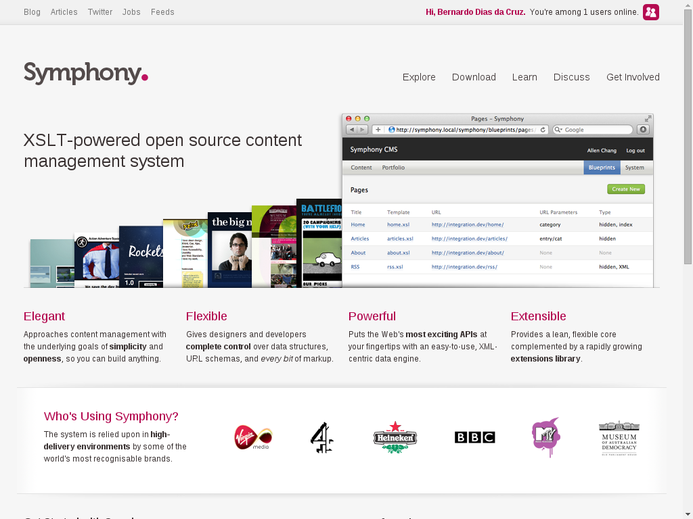

Created by Allen Chang and Alistair Kearney for over a decade, Symphony is an Open Source XSLT-based CMS built in PHP and MySQL. But don't worry about programming languages yet, this CMS is very accessible even for designers. We'll focus our attention on the amazing concept of this tool and how easy and quick you can build an entire website with, wait for it, full control of your frontend.


